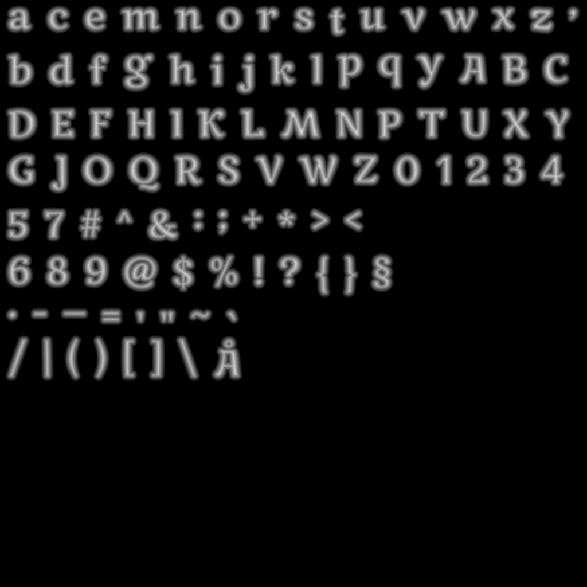

Tiny package for fast sdf font rasterization and atlas management with a simple interface. Wraps the Rust libraries fontdue, etagere and sdfer. I made this mainly because stb truetype sdf generation is way too slow (7x slower in my measurements, don't want that on application startup).

How to build for small binary size:

```sh
# build (linux or windows)
cd sdffont
RUSTFLAGS="-Zlocation-detail=none -Zfmt-debug=none" cargo +nightly build --release

# on windows if using gnu toolchain:
cd target/release
gendef sdffont.dll
dlltool -d sdffont.def -l sdffont.dll.lib -D sdffont.dll
```

How the generate sdf texture looks like:


Currently does not support multi-channel signed distance fields

### Run Odin example:

```sh
cd odin_example
odin run .
```

### Run Zig example:

```sh

```
