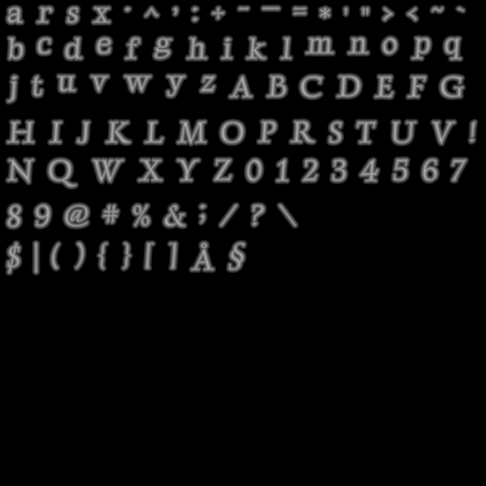

This is an Odin package wrapping the Rust libraries fontdue, etagere and sdfer to provide fast sdf font atlas generation with a simple interface.

How to build for small binary size:

```sh
# build (linux or windows)
cd sdffont
RUSTFLAGS="-Zlocation-detail=none -Zfmt-debug=none" cargo +nightly build --release

# on windows if using gnu toolchain:
cd target/release
gendef sdffont.dll
dlltool -d sdffont.def -l sdffont.dll.lib -D sdffont.dll
```

How the generate sdf texture looks like:


Currently does not support multi-channel signed distance fields
